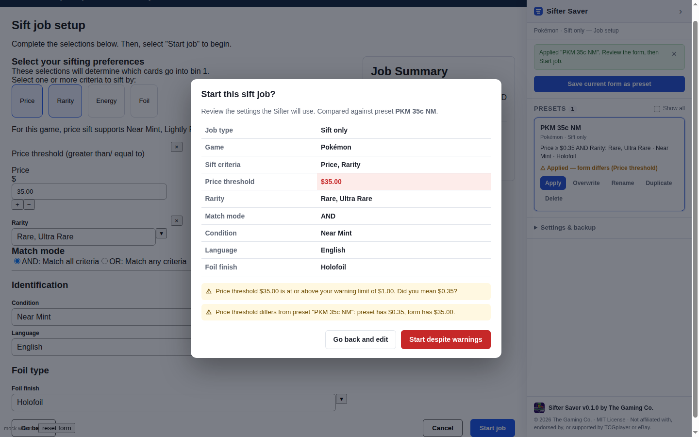
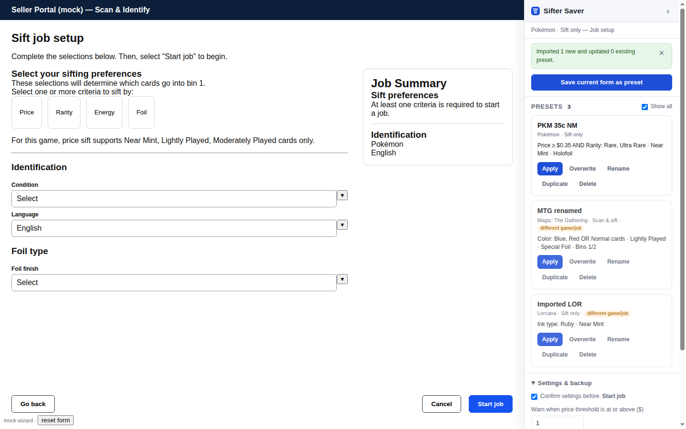

<p align="center"></p>

# Sifter Saver

A free Chrome / Firefox extension from **The Gaming Co.** for the **TCGplayer Seller Portal → Scan & Identify → Roca Sifter** job wizard.

It fixes two gaps in the stock UI:

1. **Saved job preferences.** The wizard has no way to save a sift job's preferences, so every job means re-entering the same price threshold, rarities, condition and foil type by hand. Sifter Saver adds a right-hand sidebar where the current form can be saved as a named preset and re-applied with one click.
2. **A confirmation gate on "Start job".** Before the job is sent to the Sifter, a dialog shows every setting the device will use and flags anything suspicious, such as a price threshold of `35` when `0.35` was intended, or a value that differs from the preset that was applied.

The extension never talks to TCGplayer's APIs. It only reads and fills the form on the page. Presets live in the browser's extension storage on this machine; nothing is sent anywhere.





## Install

The extension is unpacked (not from a store), so load it in developer mode.

**Chrome / Edge / Brave**

1. Open `chrome://extensions` and switch on **Developer mode**.
2. Click **Load unpacked** and choose the `SifterSaverExtension` folder.
3. Open `https://sellerportal.tcgplayer.com/scan-identify/sifter/newjob` (Manage Scans → Add scans → Roca Sifter).

Chrome shows a harmless warning about the `browser_specific_settings` key; that key is only read by Firefox.

**Firefox** (128 or newer)

1. Open `about:debugging#/runtime/this-firefox`.
2. Click **Load Temporary Add-on…** and pick `SifterSaverExtension/manifest.json`.
3. Temporary add-ons are removed when Firefox closes. On Firefox older than 128 a Manifest V3 extension does not get site access at install time, so the sidebar will not appear until you grant access to sellerportal.tcgplayer.com in the extension's Permissions tab. For a permanent install, zip the `SifterSaverExtension` folder and either sign it as an unlisted add-on at addons.mozilla.org, or use Firefox Developer Edition / ESR with `xpinstall.signatures.required` set to `false` in `about:config`.

## Using it

The sidebar appears only on the Sifter job wizard. The context line at the top shows which game, job type and step the page is on.

- **Save current form as preset** (job setup step): reads the form, suggests a name, and stores it.
- **Apply**: fills the form with the preset. Only presets for the current game and job type are listed; tick **Show all** to see the rest. Applying a preset from a different game asks first, then skips options that do not exist.
- **Overwrite / Rename / Duplicate / Delete** manage the list.
- After a preset is applied the card shows whether the form still matches it. Any later edit shows up as "form differs".
- **Start job** opens the confirmation dialog. **Go back and edit** (the default) returns to the form; the start button changes to "Start despite warnings" when something was flagged. Escape or clicking outside also cancels.
- **Settings & backup**: turn the confirmation off, change the price level that triggers a warning (default $1), and export or import presets as JSON to move them between browsers or machines.

What a preset stores: job type, game, sift criteria (price threshold, rarities, colours/energy/ink types, foil preference, AND/OR), condition, foil finish, and for scan jobs the bins and batch-name mode. Batch names and notes are left alone because they are job-specific.

## Repository layout

```
SifterSaverExtension/   the extension (load this folder)
  manifest.json         MV3, works in Chrome and Firefox, no background script
  src/catalog.js        games, option labels, per-game rules copied from the site bundle
  src/storage.js        browser.storage.local wrapper
  src/presets.js        pure logic: build/summarise/diff presets, warnings
  src/dom.js            site adapter: selectors, readForm(), applyPreset()
  src/modal.js          dialog used for the gate and confirmations
  src/sidebar.js        sidebar UI
  src/content.js        entry: SPA route watcher, Start-job gate, action wiring
  styles/sifter-saver.css
test/                   Playwright end-to-end test against a mock of the wizard
  mock/wizard.html      reproduction of the wizard's markup and behaviour
  run.mjs               the test script (npm test)
tools/                  helpers for maintenance (icons + footer mark from the logo, HAR bundle extraction)
LICENSE                 MIT, © The Gaming Co. (a copy also sits in SifterSaverExtension/)
```

## Tests

```
cd test
npm install
npm test            # headless Chromium with the extension loaded
HEADED=1 npm test   # watch it run
```

The runner serves `test/mock/wizard.html` at the real Seller Portal URL (via request interception) so the content script is injected exactly as in production. Screenshots land in `test/out/`.

## How it works, and what to do when TCGplayer changes the page

The wizard is a Vue 3 single-spa micro-frontend (`sellerportal-quicklist-app.tcgplayer.com/quicklist.js`). The extension runs as an isolated-world content script and drives the form through the DOM:

- criteria are `button.job-config__criteria-card` toggles;
- the price field is `input.currency-input__input`, updated with `input` then `blur` events;
- selects are the design-system `tcg-input-select`; their `li.tcg-base-dropdown__item` options are always in the DOM and can be clicked directly;
- radios and checkboxes are native inputs inside `tcg-input-radio` / `tcg-input-checkbox`;
- the primary footer button is `button.sellerportal-sifter-job__footer-primary` and reads "Start job" on the last step. The gate is a capture-phase click listener on `document` that stops the event before Vue's handler, then re-dispatches the click after confirmation.

All selectors are in one place, `SEL` at the top of `src/dom.js`. If a site deploy renames classes, that is the file to update. `tools/extract_from_har.py` decodes the quicklist bundle from a HAR capture and prints the current class names and option tables so the catalog and selectors can be refreshed quickly.

## License and attribution

Sifter Saver is © 2026 The Gaming Co. and released under the [MIT License](LICENSE). You may use, copy, modify, and redistribute it, including commercially, as long as the copyright notice and license text stay with it. A copy of the license ships inside `SifterSaverExtension/` so packaged builds carry it too.

If you fork or redistribute it, a line such as "Based on Sifter Saver by The Gaming Co. (https://github.com/sellrey/sifter-saver-extension)" in your README or store listing is appreciated, and the sidebar footer already credits The Gaming Co. in the extension itself.

The Gaming Co. logo in this repository is a trademark of The Gaming Co. and is not covered by the MIT License. Forks should replace it with their own branding.

## Disclaimer

Sifter Saver is an independent project. It is not affiliated with, endorsed by, or supported by TCGplayer or eBay. "TCGplayer", "Scan & Identify", and "Roca Sifter" are their trademarks and are used only to describe what this extension works with. The extension is provided as is; check the confirmation dialog before every job, since a sift job runs on physical hardware.

## Privacy

The extension has no network access of its own and never contacts TCGplayer's APIs or any other server. Presets and settings are stored in the browser's local extension storage on your machine, and the only way they leave it is the Export button, which writes a JSON file you choose where to save.

## Limitations

- Presets are per browser profile. Use Export / Import to share.
- Firefox needs a signed build for a permanent install (see above).
- The confirmation dialog checks the form, not the device. The site still performs its own validation and connection checks after confirmation.
